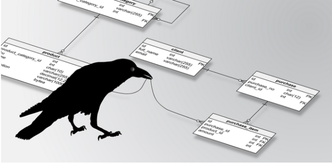
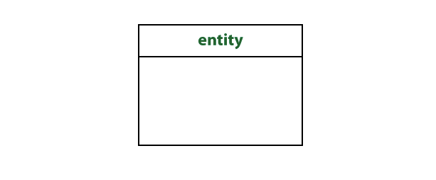
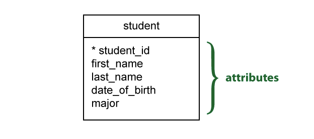
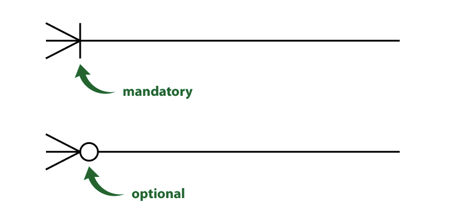
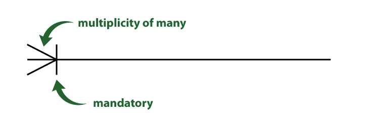

A number of data modeling techniques are being used today. One of the most common is the Entity-Relationship Diagram (ERD). There are several ERD notation available: today we will be using Crow's Foot Notation!

# Crow's foot notation 

Entity-relationship diagrams are a useful tool for designing databases. A method often used to create an entity-relationship diagram is crow's foot notation (also know as IE notation). 

This method was introduced in the 70' by Gordon Everest and it has been called inverted arrow, chicken feet, or just fork.

The most important characteristic of crow's foot notation is that it uses graphical symbols to indicate the 'many' side of the relationship. The three-pronged 'many' symbol is also how this widely-used notation style got its name.

## Crow's Foot Notation symbols

Now, let's tak about the representation of entities and relationships:

## but... What is an entity?

An entity is a representation of a class of object. It could be a person, place, thing, etc. 

It is represented by a rectangle, with its name on the top. 

The name is singular (entity) rather than plural (entities).

## and...attributes?

An attribute is a property that describes a particular entity.

The attribute(s) that uniquely distinguishes an instance of the entity is the id and it's usually marked as an asterisk.

## What are relationships?

They illustrate the association between two entities. They are presented as a straight line. Usually, each relationship has a name, expressed as a verb, written on the relationship line. This describes the kind of relationship connecting the objects.

[[warning]]
| :point_up:Note: The mentioned type of relationship is binary. In the Entity-Relationship model, representing a ternary or higher order of relationship is problematic.

## What is cardinality?

Relationships have to indicators and they are shown on both sides of the line.

+ The first one (often called multiplicity) refers to the *maximum* number of times that an instance of one entity can be associated with instances in the relates entity. It can be **one** or **many**.

+ The second describes the *minimum* number of times one instance can be related to others. It can be **zero** or **one**, and accordingly describes the relationship as **optional** or **mandatory**.

These indicators are combined in a specific order. Placed on the outside edge of the relationship, the multiplicity symbol comes first. The symbol indicating wether the relationship is mandatory or optional is shown after the symbol of multiplicity.

In crow's foot notation:

+ A multiplicity of one and a mandatory relationship is represented by a straight line perpendicular to the relationship line.

+ A multiplicity of many is represented by three-pronged 'crow-foot' symbol.

You can see from this image just where the name "crow's foot" came from...

+ An optional relationship is represented by an empty circle.

Finally! There are 4 possible edges to the relationship, illustrated here:

+ zero or many:

+ one or many

+ one and only one

+ zero or one:

Relationship degrees make them readable as:

+ one-to-one

+ on-to-many

)

+ many-to-many

.. Well, it is not that difficult.. is it????....

