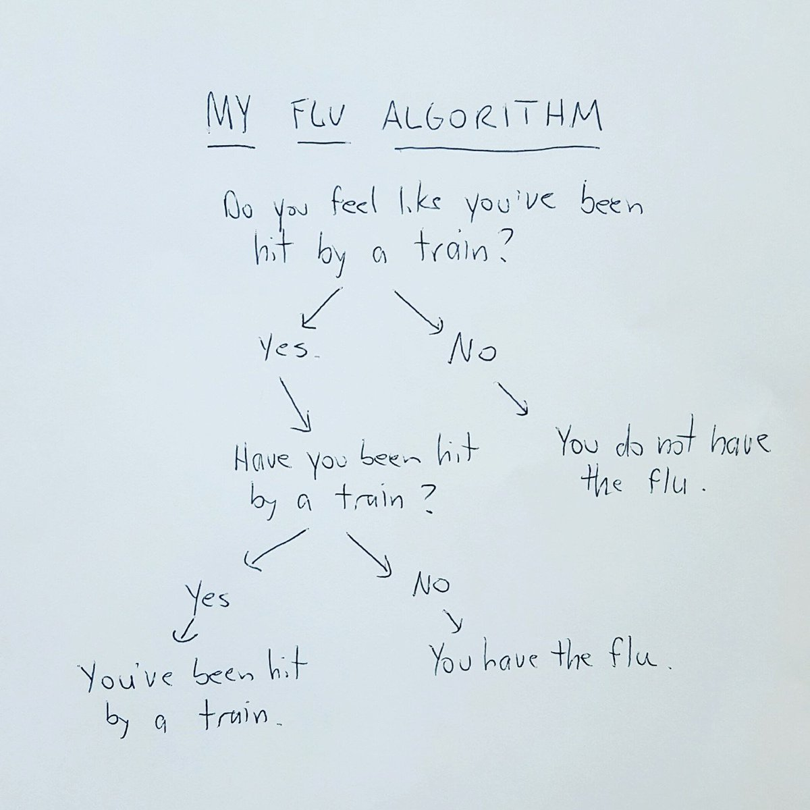

Dominar el uso de las condiciones es una de las 5 habilidades fundamentales de construir algoritmos:

1. Variables.
2. `Condicionales`.
3. Arrays(Arreglos).
4. Loops(Bucles).
5. Funciones.

Las condiciones son la única forma en que los desarrolladores tienen que decirle a la computadora cómo tomar decisiones en tiempo real, muy similar a cómo funcionan los cerebros.

Digamos que estamos construyendo un programa para ayudarnos a elegir qué vestir y odiamos el color azul, podemos decirle a la computadora que evite el azul usando una condición como esta:
  
  
`If` ***color*** is not **blue**, then... do something.  
`Else`... do nothing or exit.
  


Y así es como escribiríamos esto en Javascript:

```js
if(color != 'blue'){
    //Cualquier código aquí se ejecutará cuando el color sea diferente al azul.
}
else{
    //solo ejecutará este código si el color es azul.
}
```

## Se trata de qué preguntas hacer

El ejemplo anterior era una condición simple, pero en la vida real elegir qué guardar implica una combinación de varias condiciones para tomar la decisión final, por ejemplo: veamos este algoritmo que indica si tienes gripe


Si desea representar este algoritmo en Javascript, se verá más o menos así:

```js
let sientoQueMeAtropelloUnTren = verdadero;
let meAtropelloUnTren = falso;

if(sientoQueMeAtropelloUnTren  == verdadero){
  if(meAtropelloUnTren == verdadero){
    console.log("Tú no tienes gripe");
  }
  else{
    console.log("Tú tienes gripe");
  }
}
else{
  console.log("Tú no tienes gripe");
}
```

Básicamente, este algoritmo tiene dos variables a considerar: `sientoQueMeAtropelloUnTren` y `meAtropelloUnTren`.
Nuestro trabajo como desarrolladores es intentar preparar una estrategia y crear un algoritmo que resuelva un problema.

## Operadores `AND` y `OR`

Otra forma de escribir el algoritmo es combinar preguntas en la misma condición utilizando los operadores `AND` y` OR` que en Javascript se representan con `&& para AND` y` || para OR`:

```js
if(sientoQueMeAtropelloUnTren == falso || meAtropelloUnTren == verdadero){
  console.log("Tú no tienes gripe");
}
else if(sientoQueMeAtropelloUnTren == true && meAtropelloUnTren == falso){
  console.log("Tú tienes gripe")
}
else{
  console.log("No tengo idea");
}
```

Como puedes ver aquí, estamos usando `else if` juntos por primera vez, para una codificación más rápida. Otro truco que puedes usar para una codificación más rápida:

| Original | Equivalente |
| --- | --- |
| en lugar de `if(sientoQueMeAtropelloUnTren == verdadero)` | escribes `if(sientoQueMeAtropelloUnTren)`  |
| en lugar de `if(sientoQueMeAtropelloUnTren == falso)` | escribes `if(!sientoQueMeAtropelloUnTren)` |

## Operadores mayores que o menores que `>` y `<`

En el caso particular de que esté comparando números, también puede hacerlo si uno de los números comparados es mayor o menor que el otro:

```js
if (goingOut){
  if (canIGetBurger){
    if (placeBotleWine){
      if (coolMix){
          //do something
      }
    }else{
      if (blazers > 3){
      }else{
          //do something
      }
    }
  }else if (shePants){
      //do something
  }else{
      //do something
  }
}else{
  if (nakedSheDoor){
      //do something
  }else if (blazers > 3){
      //do something
  }else{
      //do something
  }
}
```

## Operador Ternario (condiciones en línea)

Otro gran truco para una codificación más rápida es usar ternarios que básicamente nos permiten codificar todo en una sola línea:
```js
const flu = (sientoQueMeAtropelloUnTren && !youWereHitByTrain) ? verdadero : falso;
```
En este ejemplo, la variable `flu` solo será verdadera si` sientoQueMeAtropelloUnTren == verdadero` y `sientoQueMeAtropelloUnTren == falso` al mismo tiempo. Si esa pregunta no es cierta, entonces flu será falso.

Los ternarios se usan MUCHO en estos días porque te ahorran mucho tiempo.

## Renderizando Condicionales

Otro gran uso de las condiciones es generar HTML basado en ciertas condiciones, por ejemplo, digamos que tenemos un bootstrap Alert que estamos a punto de presentar en el sitio web:

```js
let alertHTMLCode = "<div>Cuidado! Tu no puedes manejar</div>";
```

Si queremos que esta alerta se muestre solo si el usuario es menor de 16 años, podríamos hacer algo como:

```js
let age = 14;
let alertHTMLCode = (age < 16) ? "<div>Cuidado! Tu no puedes manejar</div>" : "";
```

Ahora nuestra variable `alertHTMLCode` estará vacía si la edad del usuario es menor de 16 años, si es mayor, contendrá todo el HTML.

<script async src="//jsfiddle.net/BreatheCode/bycgsnqt/7/embed/js,html,result/"></script>

