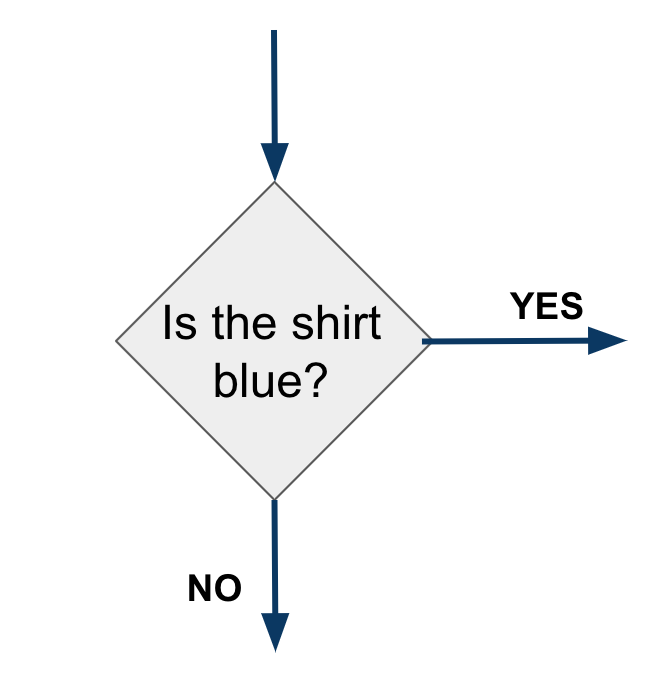
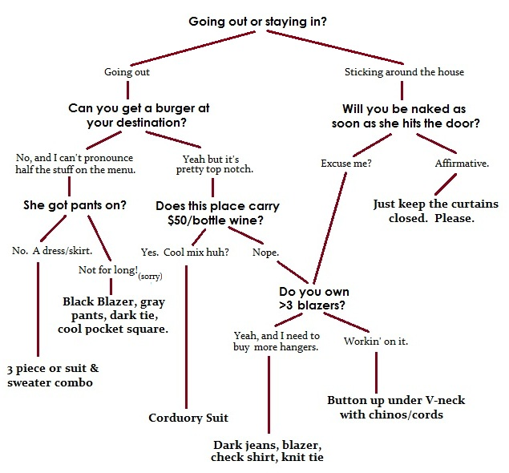

## Introducción a los condicionales en Python 

Dominar el uso de las condiciones es una de las 5 habilidades fundamentales de construir algoritmos:

1. Variables.
2. `Condicionales`.
3. Arrays(Arreglos).
4. Loops(Bucles).
5. Funciones.

Las condiciones son la única forma en que los desarrolladores tienen que decirle a la computadora cómo tomar decisiones en tiempo real, muy similar a cómo funcionan los cerebros.

Digamos que estamos construyendo un programa para ayudarnos a elegir qué almacenar y odiamos el color azul, podemos decirle a la computadora que evite el azul usando una condición como esta:
  
```python
if color == 'blue':
    # haz algo
else:
    # haz otra cosa
```
  



[[info]]
|:link: El uso de switch no esta disponible en python


## Primero veamos que es una expresión lógica

La forma más fácil de entender expresiones lógicas (al menos para esta lectura en particular), es pensar en ellas como preguntas que podemos introducir en nuestros algoritmos, por ejemplo:

1. Si el usuario es mayor de edad.
2. Si hoy es martes.
3. Miles de otras preguntas.

Para poder hacer una pregunta, primero tienes que tener data (información) almacenada en variables, por ejemplo, podemos tener la edad del usuario almacenada en una variable `edad` y podriamos preguntar:

```python
# se utiliza dos veces igual (=) cuando quieres comparar en lugar de asigner el valor
if edad == 25:
    print("Eres mayor de edad!!")
```

### Operadores de una expresión lógica (preguntas que puedes hacer)

Para hacer una pregunta, tenemos las siguientes comparaciones: `==`, `>`, `<`, `!=`, `is None`, `is not None`, `in`:

| Operador      | Ejemplo       | Descripción   |
| ------------  | -----------   | --------------|
| `==`          | `if a == b`   | Si el valor de la variable A es igual a B |
| `<`           | `if a < b`    | Si el valor A es menor que B |
| `>`           | `if a > b`    | Si el valor A es mayor que B |
| `!=`          | `if a != b`   | Si el valor de A es diferente B |
| `is not None` | `if a is not None` | Si a es diferente de None |
| `is None`     | `if a is None`| Si el valor de A es igual a None |
| `in`          | `if name in ['bob','maria','nancy']` | Si el valor de `name` esta contenido dentro de la lista de nombres  |

## Operadores `AND` y `OR`

Otra forma de escribir el algoritmo es combinar preguntas en la misma condición utilizando los operadores `AND` y` OR`:

```python
if estoy_caliente == false AND me_duele_la_cabeza:
    if me_arrollo_un_carro == true:
        print("Tú no tienes fiebre")
    else:
        print("Si tienes fiebre")
}
else:
    print("No tienes fiebre")
```


## `if-then-else`

La estructura de las sentencias `if-then-else` es:

```python
if (expresión lógica):
    # Escribe aqui el codigo que debe ejecutarse solo si `expresion` es True
else:
    # Y aqui el codigo si `expresion` es False
```

Se evalua la expresión indicada en la sentencia if. En el caso de que la `expresión lógica` sea `True` se ejecutará el bloque de sentencias then y en el caso de que la expresión sea false se ejecutará el bloque de sentencias else.

La parte del else no tiene por qué existir. En este caso tendríamos una sentencia if-then.

```python
if (expresión lógica):
  # Escribe aqui el codigo que debe ejecutarse solo si `expresion` es True
}
```

De esta forma podríamos tener el siguiente código fuente:

```python
edad = 12

if (edad < 18):
  print("Es menor de edad")
else:
  print("Es mayor de edad")
```

Las sentencias if-then-else pueden estar anidadas, puedes preguntar muchas cosas a la misma vez, y así nos encontraríamos con una sentencia if-then-elseif, la cual tendría la siguiente estructura:

```python
if (edad < 18):
    # Cuando es menor de edad
elif (edad < 21):
    # Sabemos que es mayor de edad porque cayo en este ELSE
    # Pero tambien sabemos que es menor a 21 porque cumple con el IF
    # Es decir: tiene entre 18 y 20 años
elif:
    # Si entra aqui es porque tiene 21 años o mas
```

Este es otro ejemplo, ahora utilizando `if-then-elseif` para saber si un numero es una centena:

```python
valor = 14

if (valor < 10):
  print("El valor es una unidad")
elif (valor < 100):
  print("El valor es una decena")
elif (valor < 1000):
  print("El valor es una centena")
elif (valor < 10000):
  print("El valor es un millar")
else:
  print("Es un número grande")
```

## El `switch`

Python no tiene una sentencia `switch`, en otros lenguajes de programación podrias utilizar esa sentencia para simplificar la lógica de muchos if-else anidados, por ejemplo en Javascript seria de la siguiente manera:


## Se trata de qué preguntas hacer

El ejemplo anterior era una condición simple, pero en la vida real, elegir qué hacer implica una combinación de varias condiciones para tomar la decisión final, por ejemplo: Veamos este algoritmo que le dice a una computadora cómo decidir qué ponerse durante el día de San Valentín:



Si quieres representar este algoritmo en Java, se verá algo así:

```python
if going_out:
    if can_I_get_burger:
        if place_bottle_white:
            if cool_mix:
                # haz algo con tu codigo aqui
    else:
        if blazers > 3:
            # haz algo con tu codigo aqui
        else:
            # haz algo con tu codigo aqui
    elif she_pants:
        # haz algo con tu codigo aqui
    else:
        # haz algo con tu codigo aqui
else:
    if naked_she_door:
        # haz algo con tu codigo aqui
    elif blazers > 3:
        # haz algo con tu codigo aqui
    else:
        # haz algo con tu codigo aqui
```
