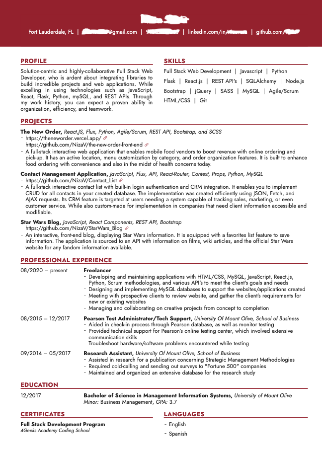

## Experiencia laboral

1. No añadas más de tres experiencias laborales pasadas, a menos que sean realmente relevantes o relativas a la programación.
2. Necesitas experiencia en el desarrollo de software ¿Qué pasa si no la tienes?

Haz un pasantía en cualquier compañía (aunque no te paguen) porque debes añadir eso en tu cv para estar en una mejor posición cuando busques empleo:

```
Cargo: 
Desarrollador Web Freelance en MyCompany Media

Descripción:
Responsable de diseñar, codificar y modificar aplicaciones de React y APIS de Python desde el layout/mockups/wireframes hasta convertirlos en funcionales de acuerdo a las especificaciones del cliente. Enfocado en crear sitios visuales llamativos con un diseño amigable para el usuario con una navegación clara. 

```

Nota: NO COMPIES Y PEGUES, por favor personalízalo, usa otras palabras, diferentes tecnologías y lenguajes de programación que te gusten, puedes hablar sobre aplicaciones de eCommerce, edTech, puedes mencionar alguna industria en particular que te guste.

Si tu proyecto final fue un juego, puedes decir que te especializas en construir juegos con HTML/CSS/Javascript/Python.
Si fue una red social entonces te especializas en "aplicaciones sociales", etc.
Si fue un sitio de tutorías, puedes decir que te enfocas en edTech..

## Educación

Si tienes un posgrado o un título es muy bueno, también puedes añadir la educación que obtuviste en 4Geeks Academy.

No añadas otros certificados de estudios pequeños, si los tienes, en esta sección. Eso sería una nueva sección de tu cv llamada 'certificaciones'.

## Certificados

Añade certificados de marketing o diseño (porque son relevantes a la programación).
Si estás certificado en el diseño de aplicaciones de software relevantes o en aplicaciones empresarialwa como Photoshop, SAP, Microsoft Dynamics, etc.

## Proyectos

Los proyectos que publiques deben ser de buena calidad, **no publiques**: un simple to-do list, un generador de tarjetas aleatorio, una juego de gato. Nada de eso es impresionante.

**Puedes publicar**: 

Versiones mejoradas de algunos proyectos que hayas hecho en la academia, por ejemplo:

- Starwars Reading List: Puedes hacer un club, cada usuario tiene contraseña y comparte sus favoritos.
- Contact List: Haz de ella un CRM, básicamente le agregas un "status" a cada contacto y luego la gente de ventas puede cambiar el status del contacto según el proceso de venta.
- Todo List: Las tares pendientes deben tener dos status: Terminadas y Pendientes, tu puedes hacer que tengan varios: No realizadas, en proceso, aprobadas, rechazadas, etc. Eso hará que tu lista de tareas sea una herramienta de gestíon de proyectos con etapas.

Cada uno de tus proyectos debe tener:
- Un live link
- Un Readme descriptivo con pantallazos.
- Un código organizado.

Nota: La calidad es más importante que la cantidad, dos o tres proyectos son suficientes si son realmente buenos.

## Habilidades

Estas son las tecnologías requeridas más importantes:

```
HTML5/CSS3, Bootstrap, Javascript ECMAScript 2020, Node.js, GIT/Github, Python, Flask, API's, React.js, Flux, SCRUM, SQL, SQLAlchemy, MySQL, Postgress API's
```

También has aprendido tecnologías secundarias que pueden ser útiles dependiendo de la compañía a la cual estas postulando:

```
Heroku, Markdown, Use Stories, Data-Structures, Data-Modeling, REST, MVC, programación orientada a objetos, DOM.
```

Adicionalmente estas son buenas tecnologías que no enseñamos durante las 16 semanas pero que son fáciles de aprender y añaden mucho valor a tu curriculum:

```
Unit testing, jQuery, Gatsby.js, SSR, AWS, Firbase, WordPress, React Native.
```
