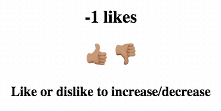
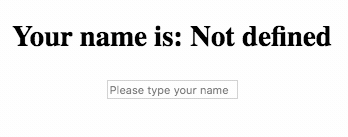
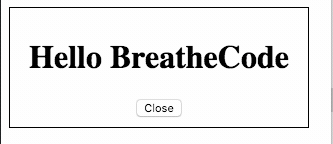

## Why hooks?

Functional components passing props are amazing because they are simple, perform fast, and require little code- but they can lead to the much dreaded "wrapper hell" in the quest for maintaining encapsulated components. On the other hand, class components are often confusing to work with for both humans and machines- they often lack a positive developer experience, which makes it more difficult creating a more positive user experience as well. Hooks provide a way for us to use state and lifecycle methods with minimal code- like giving your components super powers!

### My components need super powers?

In general, using props is enough to create an amazing component, but sometimes you need more. Here are some really useful examples for using hooks:

1. If you want to open or close a modal or dialog- use the **useState** hook.
2. If you want to fetch some data only at the beginning of the program execution, use the **useEffect** hook.
3. If you want to share information within all components, use the **useContext** hook. We will talk more about the useContext hook on a separate lesson.

Through experience, you will learn when to use a hook. If you don't think you need them, DON'T use them! The less the better.

### Most applications need at least one <strong>useState</strong> and one <strong>useEffect</strong>. To make use of hooks, we MUST FIRST IMPORT them at the beginning of our file. For example, if we need useState, we would do:

```jsx
import React, { useState } from 'react';
```

And if we want to use useEffect as well, we can include like this:

```jsx
import React, { useState, useEffect } from 'react';
```

Now let's learn how to use them :)

## The `useState` hook:

The most important hook, almost unavoidable! The <strong>useState</strong> helps you initialize a variable and change its value over time without the need of parent components. This is how you can use it:
```jsx
//       variable name      setter name               initial value (any value)
const [ mySuperVariable, mySuperFunction ] = useState(          null        );
```

Basically mySuperVariable will be initialized with `null`, and then you will be able to re-set its value by calling `mySuperFunction` like this:

```jsx
// here we are re-setting the value of mySuperVariable = 'hello' when the user clicks on a button:
<button onClick={() => mySuperFunction('hello')}></button>
```

### Possible uses for </strong>the ` useState` hook</strong>

|  |  |  |
| ----------- | ---- |
| 1. Counting: Displaying the number of likes on the screen and being able to increase or decrease when the user clicks, [click here for demo](https://codesandbox.io/s/wild-pond-soxu8?fontsize=14) |  |
| 2. Timer/Clock: You can use the system time to show the current time on the screen, but since time changes all the time, we store it with a state variable, [click here for demo](https://codesandbox.io/s/hungry-paper-kkh7g?fontsize=14) |  |
| 3. Showing an input on the screen: The best practice to get the content from any input is by storing it on a state variable- this is colled "Controlled Input", [click here for a controlled input example](https://codesandbox.io/s/brave-albattani-irhy7?fontsize=14) |  |
| 4. Opening/Closing (show/hide): A typical use case is having a dialog that asks a question or allows a user to sign up for a newsletter, [click here for the example](https://codesandbox.io/s/modal-window-component-with-hooks-vb6de?fontsize=14). |  |
| 5. Thousands of other possible applications. | |

Let's explain this hook with a small Modal window example. Here is the live code:

<iframe src="https://codesandbox.io/embed/goofy-sutherland-vb6de?fontsize=14" title="Modal with hooks" allow="geolocation; microphone; camera; midi; vr; accelerometer; gyroscope; payment; ambient-light-sensor; encrypted-media; usb" style="width:100%; height:500px; border:0; border-radius: 4px; overflow:hidden;" sandbox="allow-modals allow-forms allow-popups allow-scripts allow-same-origin"></iframe>

To implement a "Modal Window" we decided to create a hooked variable called `opened` that is `true` if the modal window has to be shown to the user.

If the user clicks on "close" we simply use the hook function `setOpened` to change the value of `opened` to false.

## The `useEffect` hook:


useEffect is another amazing hook that you will use if you want to execute some code after the component renders, for example:

#### 1) After the component renders for the first time (like the good old componentDidMount).
```jsx
const MyComponent = () => {
    useEffect(() =>

        // whatever you code here will execute only after the first time the component renders

    , []);// <------ PLEASE NOTICE THE EMPTY ARRAY


    return <Some HTML>;
}
```
[[info]]
| :point_up: Please notice the `[]` as the second parameter of the useEffect.

#### 2) Every time (or some times) after the component re-renders.
```jsx
const MyComponent = () => {
    useEffect(() =>
        // this will run every time the component re-renders
        if(some_condition){
            //this will run only if some_condition is true
        }
    );// <------ PLEASE NOTICE THE EMPTY ARRAY IS GONE!

    return <Some HTML>;
}
```
[[info]]
| :point_up: This useEffect does not have an empty array `[]` as second parameter.

#### 3) When the component will unmount or stop being rendered (like the good old componentWillUnmount function used by class components).
```jsx
const MyComponent = () => {
    useEffect(() =>
        // this will run only the first time the component renders.
        return () => {
            // this will run only right before the component unmounts
        }
    ,[]);// <------ PLEASE NOTICE THE EMPTY ARRAY

    return <Some HTML>;
}
```

## Building a Todo List Using just `useState` and `useEffect` Hooks

<p align="center">
    
</p>

For example, let's say I'm building a todo list, and I have to load the list of tasks from an API. I will have to fetch the information right after the component renders for the first time:

```jsx
const Todos = (props) => {
    // initialize the tasks variable to an empty array and hook it to setTasks function
    const [ tasks, setTasks] = useState([]);

    // this function useEffect will run only one time, when the component is finally loaded the first time.
    useEffect(() =>
        // here i fetch my todos from the API
        fetch('https://assets.breatheco.de/apis/fake/todos/user/alesanchezr')
            .then(r => r.json())
            .then(data => setTasks(data)) //here it re-set the variable tasks with the incoming data
    , []);

    return <ul>{tasks.map(t => <li>{t.label}</li>)}</ul>;
}
```
[[demo]]
| Review the code in depth and live demo by [clicking here](https://codesandbox.io/s/xenodochial-varahamihira-egh86?fontsize=14)

## Further Reading
For more information, including [how to build your own hooks](https://reactjs.org/docs/hooks-custom.html), check out: [Official React Documentation](https://reactjs.org/docs/hooks-overview.html)

