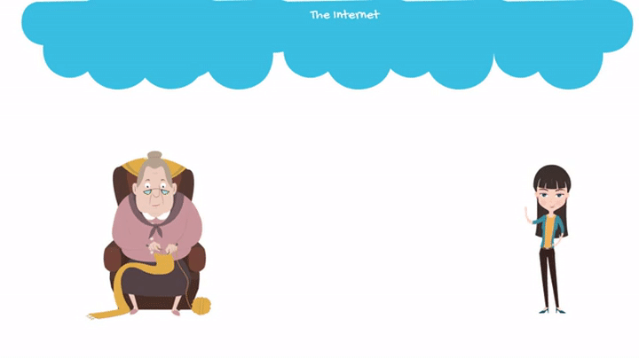
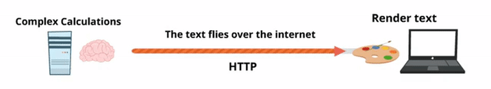

## Todo cobra sentido si retrocedemos en el tiempo…

Si todo es un documento de texto ¿cómo es posible tener sitios web tan increibles como Facebook, Youtube, etc?

Los sitios web de hoy son muy diferentes a los de antes; no tienen los mismos elementos, pero si retrocedemos un poco en el pasado y exploramos el comienzo de Internet, todo tendrá sentido.

La Internet fue creada para intercambiar información, sus fundadores estaban buscando compartir documentos de forma rápida y sin tener que manejar una infraestructura compleja. Necesitaban un marco de trabajo y la tecnología para que cualquier persona que quisiera compartir un documento pudiera publicarlo independientemente e invitar a otros a leerlo.

La comunidad científica lo empezó a usar para el famoso ["Peer Reviews"](https://www.elsevier.com/reviewers/what-is-peer-review), que requería de 3 colegas para revisar y aprobar una publicación antes de ser aceptada y publicada para toda la comunidad.

Por esta razón buscaron hacer algo que se asemejara lo más posible a un documento de MS Word o cualquier procesador de texto.

[[info]]
| :point_up: Si quieres seguir leyendo sobre la historia de internet, te recomendamos ["este video super cool"](https://www.youtube.com/watch?v=BWb6ri3ePew). Si prefieres leer[haz clic en este link ->](https://www.internetsociety.org/internet/history-internet/brief-history-internet/)

>En resumen:

> La forma más sencilla de ver Internet es como una red de documentos compartidos que alguna vez fueron publicaciones científicas, 
> rígidas y formales que hoy vemos como documentos interactivos, emocionantes y espectaculares.

## Todo es texto (HTTP)

Como era de esperarse, si vas a compartir documentos todo lo que necesitas es texto. Cuando haces páginas web todo corre bajo el protocolo HTTP (The Hypertext Transfer Protocol) que es un especialista en la transmisión de texto.

Lo que esto quiere decir es que: **todo es texto**. Por ejemplo, si quieres enviarle una foto a tu abuela por correo electrónico esto es más o menos lo que pasa:

+ La foto se convierte en texto (un texto que, en este momento, no vas a poder entender).
+ Se transmite a través de internet como texto. Si un hacker intercepta esto, lo que vería es un conjunto de símbolos / letras / números uno tras otro.
+ Esta larga secuencia de caracteres llega al computador de tu abuela.
+ Tu abuela hace doble clic en la foto y el programa que está usando para ver la foto transforma ese texto nuevamente en una imagen comprensible para un humano.

  
<small style="color:grey">Imagen 1: Los 4 pasos necesarios para enviar imágenes a través de Internet: primero se convierte en texto, luego viaja, luego llega al computador de la abuela, la abuela abre la imagen y la imagen se muestra ... ¡finalmente, la abuela está feliz mirando a su nieto! </small>

## Pero, ¿cómo viajan las imágenes (y las cosas)?

Todo está conectado. La mejor manera de entender esto es comparándolo con el servicio postal:

+ Las autopistas y las calles son los cables de red en sus paredes (o las antenas de transmisión en los techos).
+ Los vehículos que transportan el correo son los paquetes de información de viaje.
+ Las casas, edificios y tiendas son las páginas web / sitios de compras en línea - los parques serían redes sociales, etc.
+ La dirección es el famoso nombre del dominio (.com, .net, etc.)
+ Los los bloques de edificios son los servidores donde se alojan las páginas web.

<iframe width="807" height="453" src="https://www.youtube.com/embed/UiBT3Kj8KBM" frameborder="0" allow="accelerometer; autoplay; encrypted-media; gyroscope; picture-in-picture" allowfullscreen></iframe>

<small>
<strong>Video:</strong>Video de 2 minutos explicando cómo funciona internet.
</small>

## El Navegador Web

¿Recuerdas cómo dijimos que los servidores son los bloques de edificios? Bueno, para alojar un sitio web, los servidores deben cumplir todos los requisitos necesarios para que la página web no se caiga (al igual que los bloques de edificios).

Los sitios web residen en los servidores. Cuando los usuarios desean visitar sitios web, deben ingresar la dirección URL en su navegador. Esto los llevará al inicio o entrada de la página web (que se llama "index.html").

¡Imagina que los navegadores son vehículos capaces de conducir a través de las autopistas de Internet, llevándote a cualquier parte!

Si has estado leyendo y has entendido todo hasta ahora, debes estar pensando:

### Si Internet es todo texto ... entonces, cuando esté navegando, solo veré texto. ¡¡¡Qué horrible!!!

Bueno ¡no te preocupes! Los navegadores están equipados con ventanas 'mágicas'. Si ves a través de esas ventanas, verás el mundo tal como y como es: ¡Sin texto! El navegador debe realizar todas las funciones que todas las demás aplicaciones de tu computador realizarán, como por ejemplo representar de imágenes, videos, texto, sonidos, etc. El navegador es tan increíble que incluso hay computadores, como el  Google Chromecast, que solo vienen con un navegador.

[[info]]
| :tv: [Haz clic aquí](https://www.youtube.com/watch?v=0QRO3gKj3qw) para acceder a un video que explica cómo funciona un Chromebook de Google.

## El Cliente y El Servidor

Mientras navegas por Internet, el navegador debe traducir cada texto que encuentre en el camino mientras lo transforma en páginas web con títulos, subtítulos, texto, imágenes, etc.

Como desarrollador, debes codificar todo lo que el navegador necesitará para visualizar el texto. Lo llamaremos "el lado del cliente" porque el navegador está instalado en la computadora del usuario. Del mismo modo, todo el código encontrado en el lado del cliente será procesado por esa computadora.

¡El servidor no tiene idea de lo que hace el navegador! (O al menos no lo hizo al principio (hace varios años) y, para decirte la verdad, todavía no lo sabe).

Entonces, ¿qué hace el servidor?

Bueno ¡hace mucho! El servidor es responsable de preparar el texto que será leído por el navegador. Los tres retos principales para el servidor son:

+ **Velocidad:** para cada servidor, hay miles de clientes. El servidor debe ser muy rápido para responder a cada cliente lo más rápido posible.
+ **Concurrencia:** no solo hay miles de clientes, cada cliente solicita texto al mismo tiempo que muchos otros. El servidor debe ser capaz de responder a muchas demandas simultáneamente.
+ **Eficiencia:** a veces, los clientes tienen demandas que son muy difíciles de resolver, incluso si se trata de un solo cliente. Imagina por un segundo que estás utilizando Google Maps para averiguar cuánto tiempo tardas en viajar de Caracas a Santiago de Chile. El servidor debe verificar los datos de tráfico, las rutas, los accidentes y ejecutar algún tipo de algoritmo para obtener la ruta y el tiempo estimado de llegada (ETA). Incluso si el resultado es una simple cadena de caracteres como "dos días, 2 horas y 30 minutos", el servidor tuvo que hacer miles de cálculos para llegar a esa conclusión.

Entonces… resumamos:

 
| El Servidor   |      El Cliente       |
|----------|:-------------:|
La misión del servidor es entregar todo el texto / información que el cliente necesita para representar correctamente el sitio web. Tiene una relación cercana con la base de datos (que administra y procesa los datos). Maneja un gran volumen de información y está preparado para responder a miles de solicitudes de clientes al mismo tiempo.     Los idiomas más utilizados son PHP, Python, Ruby y Java.   Poco a poco , el servidor ha ido delegando parte de su carga. Maneja menos cosas ahora que antes, pero las que aún maneja se repiten muchas veces. Hay servicios como Parse.com o Firebase.com que han creado herramientas que permiten a los desarrolladores crear aplicaciones web sin siquiera usar su propio servidor.     Todo el código que se ejecuta en el lado del servidor se llama " El Back-End ". Los desarrolladores de back-end deben reforzar su conocimiento en bases de datos, big data, extracción de datos, seguridad, web socket, servicios web, API's, etc. |El cliente incluye todo el código que se ejecuta en la computadora o dispositivo del cliente. Los idiomas más frecuentes son: HTML5, CSS3, JavaScript.     Originalmente, el código que residía en el cliente no hacía mucho porque los documentos eran muy simples. Pero las cosas han cambiado; la tecnología le ha dado más relevancia al cliente en un punto en el que hoy en día hay miles de aplicaciones que tienen más código en el lado del cliente que en el lado del servidor.     La ejecución del código en el lado del cliente libera la carga de el servidor. Después de todo, solo hay UN servidor por MILES de clientes.     Todo el código en el lado del cliente se llama "The Front-End". Los desarrolladores de Front End están dedicados principalmente a JavaScript , y tal vez diagramando sitios web con HTML5 o CSS3 (los diseñadores también pueden hacer esta última parte). Esto significa que deben integrar múltiples API, administrar casi todo el procesamiento de datos en el lado del cliente (para evitar tener demasiadas interacciones con el servidor), datos gráficos, modelado 3D, juegos, complementos de jQuery, AJAX, etc. |

    
